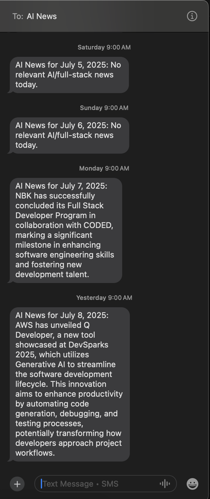

# AI NEWS GOOGLE VOICE

AI News Google Voice automatically generates AI and tech news summaries and sends them directly to your phone via Google Voice.

## What it does

- **Automated news generation** – Creates AI/tech news summaries using GPT-4
- **Google Voice integration** – Sends updates to your phone via SMS
- **Smart filtering** – Only surfaces relevant news

## How to use it

1. **Set up environment** - Add OpenAI API key and Google Voice config to `.env`
2. **Authenticate** - Run once in non-headless mode to log in
3. **Run** - Execute `npm run send-news`
